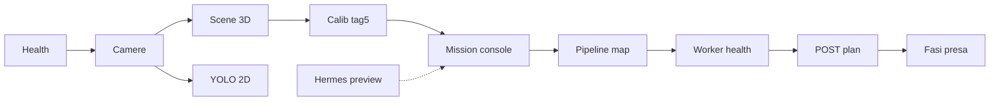

# Percorso stagista — Dashboard Go2 + D1

*Generato: 2026-06-03T14:28:38+00:00 UTC · Base: `http://192.168.123.18:5052`*

## Flusso complessivo



## Risultati probe (solo GET)

| Esito | OK=9 · FAIL=0 · step concettuali=2 |

| Step | Tab | Cosa impari | Probe |
|------|-----|-------------|-------|
| **S0** Dashboard viva | — | Prima di tutto la NX deve rispondere su HTTP. La dashboard è Flask (``serve_dashboard_lite… | `/api/health` → ok=True \| service=go2_dashboard \| pid=11211 \| process_started_at=2026-06-03T22:23:36 |
| **S1** Camere log.0 / log.6 | Scene | Due slot logici: **0** = polso (Orbbec), **6** = frontale (RealSense). Gli stream MJPEG so… | `/api/cameras/status` → ok=True \| v4l_nodes_detail=[{"dashboard_logical_slots": [], "device_family": "intel_realsense", "maps_as_depth_for_logical": [], "maps_as_rgb_for_… |
| **S2** Scena braccio (FK + mesh) | 3D | ``GET /api/arm/scene_3d`` restituisce giunti, catena FK, mesh STL opzionali, feedback serv… | `/api/arm/scene_3d` → ok=True \| servo_feedback_ok=True \| joints_deg=[13.4, -90.4, 87.0, 0.9, 14.5, 0.4, 49.7] |
| **S3** Tag 5 → base_link | Calib | AprilTag id 5 allinea il frame camera al ``base_link`` del braccio. Senza calibrazione val… | `/api/arm/calibration_flow` → ok=True |
| **S4** Mission console | Stato | Fotografia del deploy: env sicuri (flag arm/base), health worker grasp, stack NX. È il pos… | `/api/mission/console` → ok=True \| summary={"dashboard_pid": 11211, "grasp_worker": {"ok_for_plan": true, "proxy_enabled": true, "worker_backend": "planner", "wor… \| env={"GO2_DASHBOARD_BIND": null, "GO2_DASHBOARD_PORT": "5052", "GO2_DASHBOARD_PUBLIC_BASE": null, "GO2_DASHBOARD_URL_PREFIX… |
| **S5** Pipeline grasp (mappa) | Presa | Endpoint narrativo: ordine consigliato worker VLA → calib tag → movimento braccio → camere… | `/api/arm/grasp_pipeline` → ok=True \| fusion_ready_for_execute=False \| environment={"GO2_ANYGRASP_WORKER_URL": "http://13.60.243.28:8765", "GO2_ENABLE_ARM_PLAN_EXECUTE": "1", "GO2_ENABLE_GRASP_IK_EXECUT… |
| **S6** Health worker cloud | Presa | Prima di spendere GPU su EC2/RTX: ``grasp`` in mission console o proxy health. Verifica UR… | `/api/grasp/health` → ok=True \| worker_url=http://13.60.243.28:8765 |
| **S7** Piano VLA (solo lettura qui) | Presa | In UI: «Solo POST plan» invia JPEG log.0+6 al worker → JSON con bbox, heatmap, ``grasp_dis… | `—` → Step manuale in UI o ``verify_go2_lab.py worker`` — non automatizzato (costo/sicurezza). |
| **S8** Esecuzione a fasi (concetto) | Presa | Dopo un piano validato: ``pre_grasp → approach → grasp → lift`` (``GO2_GRASP_PHASE_DELAY_M… | `—` → Vedi ``go2_dashboard/grasp_phased_execute.py``. |
| **S9** Agente linguaggio (preview) | Hermes | Hermes traduce italiano → intent JSON (Sport, delta giunti, target tool). Con ``execution_… | `/api/hermes/status` → ok=True \| model=gpt-4o-mini |
| **S10** YOLO 2D | Robot | Rilevamento oggetti su un frame JPEG: bounding box in pixel, senza muovere il braccio. Uti… | `/api/vision/box_detect?camera=6` → ok=True |

## Dettaglio step (cosa dire allo stagista)

### S0 — Dashboard viva (—)

Prima di tutto la NX deve rispondere su HTTP. La dashboard è Flask (``serve_dashboard_lite.py``); ``/api/health`` conferma processo e servizio.

- **In UI:** Qualsiasi tab — badge Edge in alto se ``GO2_LOCAL=1`` sulla Jetson.
- **API sicura:** `GET /api/health`
- **Esito probe:** ok=True | service=go2_dashboard | pid=11211 | process_started_at=2026-06-03T22:23:36

### S1 — Camere log.0 / log.6 (Scene)

Due slot logici: **0** = polso (Orbbec), **6** = frontale (RealSense). Gli stream MJPEG sono ``/stream/robot/camera/{0|6}.mjpg``. Lo stato V4L elenca i nodi ``/dev/videoN`` e eventuali warning (es. log.0 assente).

- **In UI:** Scene → «Aggiorna stato», anteprime MJPEG, picker ◀▶ (solo con tutor).
- **API sicura:** `GET /api/cameras/status`
- **Esito probe:** ok=True | v4l_nodes_detail=[{"dashboard_logical_slots": [], "device_family": "intel_realsense", "maps_as_depth_for_logical": [], "maps_as_rgb_for_…

### S2 — Scena braccio (FK + mesh) (3D)

``GET /api/arm/scene_3d`` restituisce giunti, catena FK, mesh STL opzionali, feedback servo. Il viewer Three.js in tab 3D fa polling — **solo visualizzazione**.

- **In UI:** 3D → Avvia aggiornamento, modalità fast/full, overlay cilindri FK.
- **API sicura:** `GET /api/arm/scene_3d`
- **Esito probe:** ok=True | servo_feedback_ok=True | joints_deg=[13.4, -90.4, 87.0, 0.9, 14.5, 0.4, 49.7]

### S3 — Tag 5 → base_link (Calib)

AprilTag id 5 allinea il frame camera al ``base_link`` del braccio. Senza calibrazione valida, i punti 3D da visione sono meno affidabili. In lab: prima «Stato», poi «Calibra» **solo con tutor**.

- **In UI:** Calib → anteprima TAG 5; avanzato: nominali X/Y/Z.
- **API sicura:** `GET /api/arm/calibration_flow`
- **Esito probe:** ok=True

### S4 — Mission console (Stato)

Fotografia del deploy: env sicuri (flag arm/base), health worker grasp, stack NX. È il posto giusto per capire **cosa è abilitato** prima di premere Moto/Presa.

- **In UI:** Stato → Mission console → Aggiorna (auto 8s opzionale).
- **API sicura:** `GET /api/mission/console`
- **Esito probe:** ok=True | summary={"dashboard_pid": 11211, "grasp_worker": {"ok_for_plan": true, "proxy_enabled": true, "worker_backend": "planner", "wor… | env={"GO2_DASHBOARD_BIND": null, "GO2_DASHBOARD_PORT": "5052", "GO2_DASHBOARD_PUBLIC_BASE": null, "GO2_DASHBOARD_URL_PREFIX…

### S5 — Pipeline grasp (mappa) (Presa)

Endpoint narrativo: ordine consigliato worker VLA → calib tag → movimento braccio → camere. Non esegue nulla; descrive ``POST /api/grasp/plan`` e le execute successive.

- **In UI:** Presa — leggere card OpenVLA; **non** «Piano 1 click» / «Muovi IK» senza tutor.
- **API sicura:** `GET /api/arm/grasp_pipeline`
- **Esito probe:** ok=True | fusion_ready_for_execute=False | environment={"GO2_ANYGRASP_WORKER_URL": "http://13.60.243.28:8765", "GO2_ENABLE_ARM_PLAN_EXECUTE": "1", "GO2_ENABLE_GRASP_IK_EXECUT…

### S6 — Health worker cloud (Presa)

Prima di spendere GPU su EC2/RTX: ``grasp`` in mission console o proxy health. Verifica URL ``GO2_ANYGRASP_WORKER_URL`` e token configurati.

- **In UI:** Presa → «Health worker» (equivalente a parte di mission console).
- **API sicura:** `GET /api/grasp/health`
- **Esito probe:** ok=True | worker_url=http://13.60.243.28:8765

### S7 — Piano VLA (solo lettura qui) (Presa)

In UI: «Solo POST plan» invia JPEG log.0+6 al worker → JSON con bbox, heatmap, ``grasp_display_base_link_m`` o ``openvla_action_7dof``. Il piano resta in **cache** sulla NX per IK/FK execute — **questo script non chiama POST plan**.

- **In UI:** Presa → istruzione IT → «Solo POST plan» → leggere ``graspPlanJson``.
- **Esito probe:** Step manuale in UI o ``verify_go2_lab.py worker`` — non automatizzato (costo/sicurezza).

### S8 — Esecuzione a fasi (concetto) (Presa)

Dopo un piano validato: ``pre_grasp → approach → grasp → lift`` (``GO2_GRASP_PHASE_DELAY_MS``). Richiede conferma ``EXECUTE_PHASED_GRASP`` e ``GO2_ENABLE_REAL_ARM=1``. Stagista: **solo leggere** ``grasp_assessment`` nel JSON.

- **In UI:** Presa → «Sequenza presa (fasi)» — **vietato** senza area libera e tutor.
- **Esito probe:** Vedi ``go2_dashboard/grasp_phased_execute.py``.

### S9 — Agente linguaggio (preview) (Hermes)

Hermes traduce italiano → intent JSON (Sport, delta giunti, target tool). Con ``execution_mode: preview`` **non applica** motori: vedi solo proposta + Technical JSON.

- **In UI:** Hermes → radio **preview** → invia testo → approva solo se tutor lo chiede.
- **API sicura:** `GET /api/hermes/status`
- **Esito probe:** ok=True | model=gpt-4o-mini

### S10 — YOLO 2D (Robot)

Rilevamento oggetti su un frame JPEG: bounding box in pixel, senza muovere il braccio. Utile per capire cosa «vede» la rete prima del piano 3D.

- **In UI:** Robot → «Rilevamento 2D su log.6».
- **API sicura:** `GET /api/vision/box_detect?camera=6`
- **Esito probe:** ok=True

## Comandi tutor (PC in lab)

```powershell
python scripts/stagista_lab_percorso.py http://192.168.123.18:5050
python scripts/verify_go2_lab.py dashboard-nx http://192.168.123.18:5050
python scripts/verify_go2_lab.py hermes --http --url http://192.168.123.18:5050
```

## Zona rossa

- Tab **Moto**: stick Go2, slider braccio live, Salva ZERO/START
- Tab **Presa**: Piano 1-click, Muovi IK/FK, Sequenza fasi, EC2 start
- Tab **Calib**: «Calibra» / «Cancella file» senza supervisione
